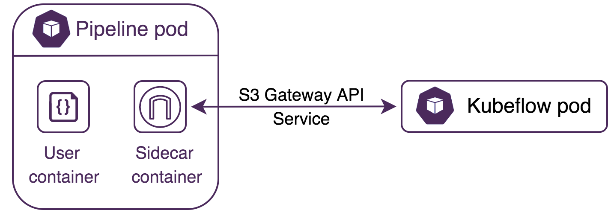

---
# metadata # 
title:  Sidecar S3 Gateway
description: Learn how to use S3-protocol-enabled pipelines and interact with external input/output data.
date: 
# taxonomy #
tags: ["deployment", "storage", "s3"]
series:
seriesPart:
--- 

Pachyderm offers the option to use **S3-Protocol-Enabled Pipelines** (i.e., Pipelines enabled to access input and output repos via the S3 Gateway).

This is useful when your pipeline code wants to interact with input and/or 
output data through the S3 protocol. For example, running Kubeflow or Apache™ Spark with Pachyderm. 

{}
Note that this use case of the S3 Gateway differs from the [Global use case](../). The latter runs directly on the `pachd` pod and exists independently and outside of any pipeline lifecycle. 
The *"Sidecar S3 Gateway"* (also referred to as *"S3 Enabled Pipelines"*), on the other hand, is a separate S3 gateway instance **running in a `sidecar` container in the `pipeline worker` pod**.
{}

{} 
Maintaining data provenance.

For example, if a Kubeflow pipeline were to read and write data from a Pachyderm repo
directly through the global S3 gateway, Pachyderm
would not be able to maintain data provenance
(the alteration of the data in the updated repo could not be traced back to any given job/input commit). 

Using an S3-enabled pipeline, Pachyderm will control the flow and
the same Kubeflow code will now be part of Pachyderm's job execution, thus maintaining proper data provenance.
{}

The S3 gateway sidecar instance is created together with the
pipeline and shut down when the pipeline is destroyed.

The following diagram shows communication between the S3 gateway
deployed in a sidecar and the Kubeflow pod.



## S3 Enable your Pipeline 
Enable your pipeline to use the Sidecar S3 Gateway by following those simple steps:

* Input repos:
  Set the `s3` parameter in the `input`
  section of your pipeline specification to `true`.
  When enabled, input repositories are exposed as S3 Buckets via the S3 gateway sidecar instance
  instead of local `/pfs/` files. You can set this property for each PFS input in
  a pipeline. The address of the input repository will be `s3://<input_repo_name>` (i.e., the `input.pfs.name` field in your pipeline spec).

* Output repo:

  You can also expose the output repository through the same S3 gateway
  instance by setting the `s3_out` property to `true` in the root of
  the pipeline spec.  If set to `true`, the output repository
  is exposed as an S3 Bucket via the same S3 gateway instance instead of
  writing in `/pfs/out`.
  The address of the output repository will be `s3://out`

{}
The user code is responsible to:

- provide its own S3 client package as part of the image (boto3).
- read and write in the S3 Buckets exposed to the pipeline.
{}

* To access the sidecar instance and a bucket, you should use the [S3_ENDPOINT](../../../deploy/environment-variables/#pipeline-worker-environment-variables) environment variable (see example below). No authentication is needed; 
  you can only read the input bucket and write in the output bucket.
  ```shell
  aws --endpoint-url $S3_ENDPOINT s3 cp /tmp/result/ s3://out --recursive
  ```

The following JSON is an example of an S3 enabled pipeline spec (input and output over S3). 
To keep it simple, it reads files in the input bucket `labresults` and copies them in the pipeline's output bucket:
```json
{
  "pipeline": {
    "name": "s3_protocol_enabled_pipeline"
  },
  "input": {
    "pfs": {
      "glob": "/",
      "repo": "labresults",
      "name": "labresults",
      "s3": true
    }
  },
  "transform": {
    "cmd": [ "sh" ],
    "stdin": [ "set -x && mkdir -p /tmp/result && aws --endpoint-url $S3_ENDPOINT s3 ls && aws --endpoint-url $S3_ENDPOINT s3 cp s3://labresults/ /tmp/result/ --recursive && aws --endpoint-url $S3_ENDPOINT s3 cp /tmp/result/ s3://out --recursive" ],
    "image": "pachyderm/ubuntu-with-s3-clients:v0.0.1"
  },
  "s3_out": true
}
```
## Constraints

S3 enabled Pipelines have the following constraints and specificities:

* The `glob` field in the pipeline must be set to `"glob": "/"`. All files
are processed as a single datum. 
In this configuration, already processed
datums are not skipped which
could be an important performance consideration for some processing steps.

* Join, group, and union inputs are not supported, but you can create a cross.

* You can create a cross of an S3-enabled input with a non-S3 input.
For a non-S3 input in such a cross, you can still specify a glob pattern.

* As in standard Pachyderm pipelines in which input repo are read-only
and output repo writable, 
input bucket(s) are read-only, and the output bucket is initially empty and writable. 

{} 
See Also
- [Configure Environment Variables](../../../deploy/environment-variables/)
- [Pachyderm S3 Gateway Supported Operations](../supported-operations)
- [Complete S3 Gateway API reference](../../../../reference/s3gateway-api/)
- [Pipeline Specification](../../../../reference/pipeline-spec/#input)
{}