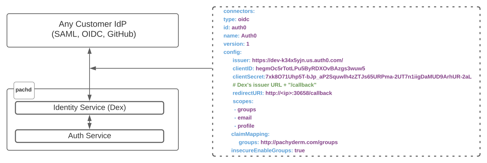

---
# metadata # 
title: Authentication and Authorization
description: 
date: 
# taxonomy #
tags: 
series:
seriesPart:
---


!!! Note
    User Access Management is an [enterprise feature](../../enterprise/) that requires
    an active enterprise token.

Pachyderm delegates its authentication to third party Identity Providers.

We embed an **Open ID Connect** identity service based on [**Dex**](https://dexidp.io/docs/) allowing for a vendor-neutral authentication (i.e., a pluggable authentication against many different identity providers).

As a result, users can authenticate **using their existing credentials from various back-ends**, including LDAP, other OIDC providers, or SAML. 

Setting up Pachyderm's User Access Management (also referred to as "Authentication and Authorization" or "Auth" in this documentation) requires to follow those 3 simple steps:

!!! Attention 
      If you have enabled the enterprise features [through Helm, auth is already activated](../auth/).

      In this case, a `pachyderm-bootstrap-config` k8s secret is automatically created containing an entry for your [rootToken](#activate-user-access-management). Use `{{"kubectl get secret pachyderm-bootstrap-config -o go-template='{{.data.rootToken | base64decode }}'"}}` to retrieve it and save it where you see fit.

	  **This secret is only used when configuring through helm**


1. [Activate the feature](#activate-user-access-management).
1. Create a connector and [connect the IdP of your choice to Pachyderm (Dex)](./authentication/idp-dex.md). 
1. Optional: Manage your Authorization. i.e.,[assign specific Roles to IdP users](./authorization/role-binding.md) on given Pachyderm Ressources. 

Any registered IdP user will then be able to log into their IdP and access Pachyderm ressources according to the privileges they were granted.

See the Identity Provider High Level Diagram below:



## Activate User Access Management
!!! Note
    Verify the status of your **Enterprise License** before activating the User Access Management feature
    by running `pachctl enterprise get-state`. The command should return an `ACTIVE`
    status along with the expiration date of the Enterprise License.   

To activate Pachyderm's authentication and authorization features,
run the following command in your terminal:

```shell
pachctl auth activate 
```
The enablement of the User Access Management **creates
an initial `Root user` and returns a `Root token`**.
This `Root user` (or initial admin) has irrevokable `clusterAdmin` privileges on
Pachyderm's cluster. More on the various types of Users, Roles, and Ressources [here](../auth/authorization/#users-types).


!!! Note
     If you run `pachctl auth activate` after having enabled your enterprise features through Helm, the original `pachyderm-bootstrap-config` K8s secret created with the installation **is not updated**. Instead, the new rootToken is printed in your STDOUT.


**System Response**
```
Pachyderm root token:
54778a770c554d0fb84563033c9cb808
```
!!! Warning 
    You must save the token to a secure location
    to avoid being locked out of your cluster.
    
    When needed, use this token to log back in as this initial admin user:

    ```shell
    pachctl auth use-auth-token
    ```

As a *Root User* (or initial admin), 
you can now configure Pachyderm to work with
the identity management provider (IdP) of your choice.

Next: [Connect the IdP of your choice to Pachyderm (Dex)](./authentication/idp-dex.md)

## Deactivating User Access Management
The deactivation of the User Access Management on a Pachyderm cluster
(as a `clusterAdmin`, run `pachctl auth deactivate`), 
returns the cluster to being a blank slate with regards to
access control.

This implies that all permissions granted to users on Pachyderm ressources are removed. Everyone that can connect
to Pachyderm is back to being a `clusterAdmin` (can access and modify all data in all repos).


## User Access Management and Enterprise License expiration
When an Enterprise License expires, a
Pachyderm cluster with enabled User Access Management goes into an
`admin-only` state. In this state, only `ClusterAdmins` have
access to the data stored in Pachyderm.

This safety measure keeps sensitive data protected, even when
an enterprise subscription becomes stale. 

As soon as the enterprise
activation code is updated (As a 'clusterAdmin', run `pachctl license activate` and submit your new code), the
Pachyderm cluster returns to its previous state.

## Auth Token Duration

Pachd auth tokens duration is set to a 30 days default in pachd environment variable  `SESSION_DURATION_MINUTES`.
