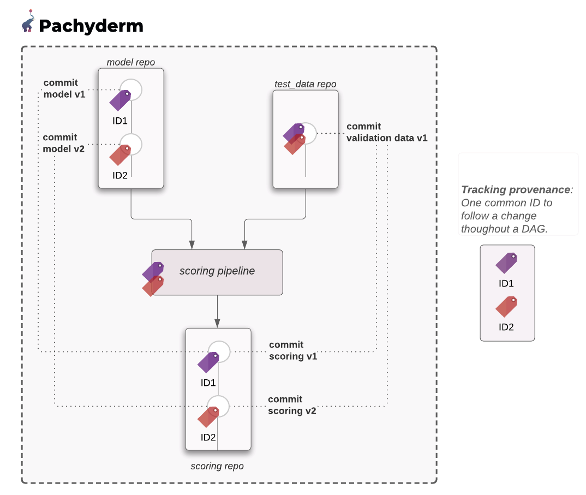

---
# metadata # 
title: Provenance
description: Learn about the concept of provenance in Pachyderm. 
date: 
# taxonomy #
tags: 
series:
seriesPart:
--- 

**Data versioning** ([History](../history/)) enables Pachyderm users to go back in time and see the state
of a dataset or repository at a particular moment. 

**Data provenance** (from the French noun *provenance* which means *the place of origin*),
also known as **data lineage**, tracks the dependencies and relationships
between datasets. It answers the question
*"Where does the data come from?"*, but also *"How was the data transformed along the way?"*. 

Pachyderm enables its users
to have both: track all revisions of their data **and**
understand the connection between the data stored in one repository
and the results in the other repository.

It automatically **maintains a
complete audit trail**, allowing all results to be fully reproducible.


The following diagram is an illustration of how provenance works:

 


In the diagram above, two input repositories (`model`
and `test_data`) feed a scoring pipeline. 
The `model` repository continuously collects
model artifacts from an outside source. 
The pipeline combines the data from these two repositories 
and scores each model against the validation dataset.

[Global ID](../../advanced-concepts/globalID/) is an easy tool
to help you [track down your entire provenance chain](#traversing-provenance-and-subvenance) 
and understand what data and transformation processes were involved in a specific version of a dataset.
Here, the ID1 is shared by all commits and jobs involved in creating the final scoring v1.
A simple `pachctl list commit ID1` (`pachctl list job ID1`) will return that list at once.


## Tracking Direct Provenance in Pachyderm

Pachyderm provides the `pachctl inspect` command that enables you to track
the direct provenance of your commits and learn where the data in the repository
originates in.

###  Example
```s
pachctl inspect commit edges@71c791f3252c492a8f8ad9a51e5a5cd5 --raw
```

**System Response:**

```s
{
    "commit": {
        "branch": {
        "repo": {
            "name": "edges",
            "type": "user"
        },
        "name": "master"
        },
        "id": "71c791f3252c492a8f8ad9a51e5a5cd5"
    },
    "origin": {
        "kind": "AUTO"
    },
    "parent_commit": {
        "branch": {
        "repo": {
            "name": "edges",
            "type": "user"
        },
        "name": "master"
        },
        "id": "b6fc0ab2d8d04972b0c31b0e35133323"
    },
    "started": "2021-07-07T19:53:17.242981574Z",
    "finished": "2021-07-07T19:53:19.598729672Z",
    "direct_provenance": [
        {
        "repo": {
            "name": "edges",
            "type": "spec"
        },
        "name": "master"
        },
        {
        "repo": {
            "name": "images",
            "type": "user"
        },
        "name": "master"
        }
    ],
    "details": {
        "size_bytes": "22754"
    }
}
```

- Provenance information: In the example above, you can see that the commit `71c791f3252c492a8f8ad9a51e5a5cd5`
    on the master branch of the `edges` repo was **automatically** produced (`origin.kind = AUTO`) from a **user** input on the master branch of the `images` repo processed by the `edges` pipeline (`direct_provenance`).

- History: Additionally, the parent  of the commit `71c791f3252c492a8f8ad9a51e5a5cd5`  in the `edges` repo has the id  `b6fc0ab2d8d04972b0c31b0e35133323`.

## Traversing Provenance and Subvenance

In Pachyderm, **all the related steps in a DAG share the same identifier**,
making it easy to traverse the provenance and subvenance in any commit.

All it takes is to run `pachctl list commit <commitID>`
to get the full list of all the branches with commits
created along the way due to provenance relationships.


Visit the [Global ID Page](../../advanced-concepts/globalID/) for more details.

